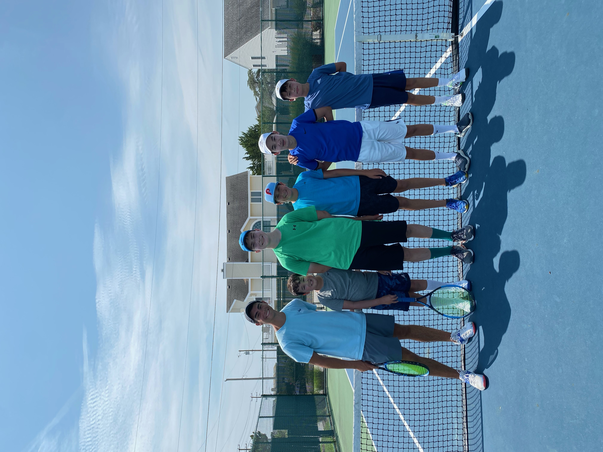

# Tennis

I am a two time state champion in Delaware and have been playing tennis since I was 10 years old. Since then, I have taken up squash, pickleball, and pretty much any other racket sport. I am still looking to try Padel though.

I have also spent time teaching tennis to kids at Rodney Street Tennis, and I have also worked as a private instructor. I love helping people learn a new skill, and I have enjoyed working with players from ages 6 to 65. My current efforts are focused on teaching my girlfriend.

